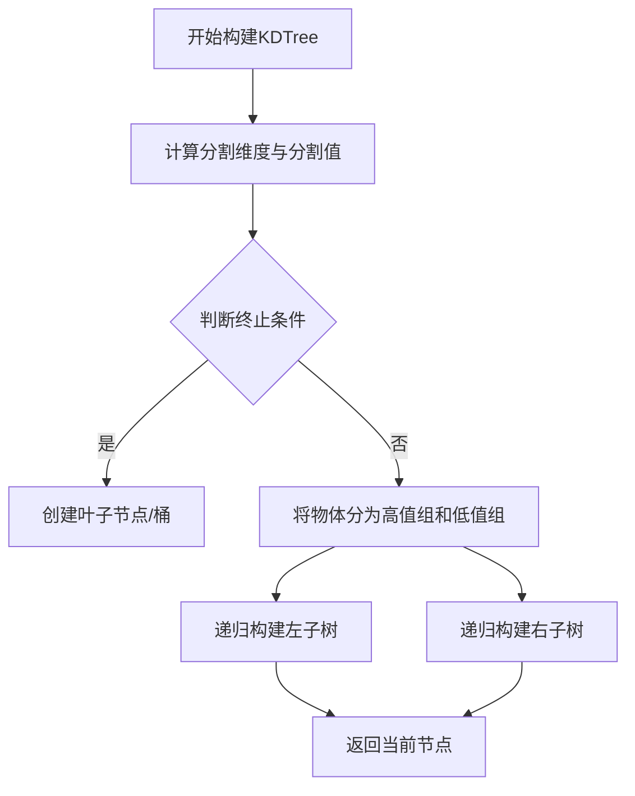
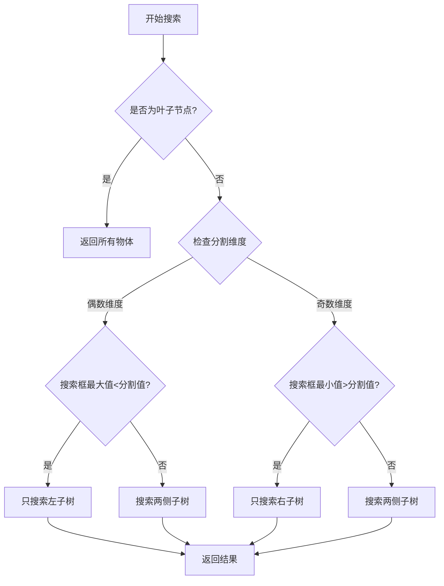

# KDTree实现原理

KDTree (K维树) 是一种用于高效空间搜索的数据结构，在OpenCAMlib中主要用于快速查找与刀具重叠的三角形。

## 数据结构

KDTree由以下关键组件构成：
- **KDNode节点**：包含分割维度、分割值、父节点引用、高值子节点、低值子节点以及物体列表
- **Spread类**：用于计算和表示物体在各维度的分布范围
- **Bbox**：用于表示物体或查询区域的边界框

## 构建原理

KDTree构建采用自顶向下的递归方式：

1. **计算分割维度与分割值**：
   - 通过`calc_spread()`函数计算当前节点的物体在各维度上的分布范围
   - 选择范围最大的维度作为分割维度
   - 在该维度上取中值作为分割值：`cutvalue = spr->start + spr->val / 2`

2. **终止条件**：
   - 当节点中物体数量小于等于bucketSize
   - 或者最大spread接近于0时
   - 创建叶子节点(桶节点)并存储所有物体

3. **递归构建**：
   - 将物体分为两组：高于分割值(hilist)和低于分割值(lolist)
   - 为两组分别递归创建子节点

## 搜索原理

搜索过程也是递归进行的，主要功能是找出与给定边界框重叠的所有物体：

1. **叶子节点处理**：
   - 如果当前节点是叶子节点，返回该节点存储的所有物体

2. **分支决策**：
   - 根据当前节点的分割维度和分割值，决定搜索路径
   - 偶数维度(0,2,4)表示最小边界(xmin,ymin,zmin)
   - 奇数维度(1,3,5)表示最大边界(xmax,ymax,zmax)

3. **搜索策略**：
   - 如果搜索边界框完全在分割面的一侧，只需搜索该侧子树
   - 否则需要搜索两侧子树

## 特殊设计

1. **维度设置**：
   - 使用6维边界框表示(xmin,xmax,ymin,ymax,zmin,zmax)
   - 可通过`setXYDimensions()`、`setYZDimensions()`、`setXZDimensions()`方法灵活设置搜索平面

2. **刀具搜索**：
   - `search_cutter_overlap()`方法专门用于刀具与物体的碰撞检测
   - 根据刀具位置和半径构建搜索边界框

3. **性能优化**：
   - 通过合理的bucketSize设置平衡树的深度和搜索效率
   - 避免无谓的子树搜索提高查询效率 