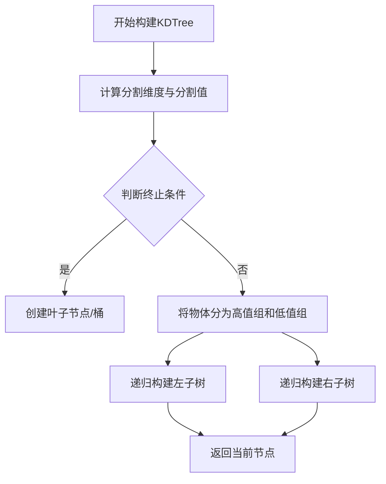
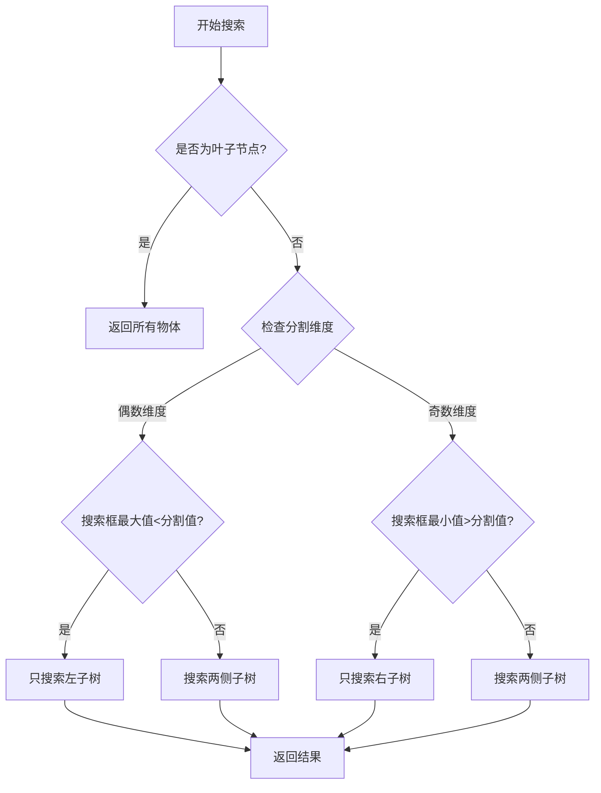

# KDTree实现原理

KDTree (K维树) 是一种用于高效空间搜索的数据结构，在OpenCAMlib中主要用于快速查找与刀具重叠的三角形。

## 数据结构

KDTree由以下关键组件构成：

- **KDNode节点**：包含分割维度、分割值、父节点引用、高值子节点、低值子节点以及物体列表
- **Spread类**：用于计算和表示物体在各维度的分布范围
- **Bbox**：用于表示物体或查询区域的边界框

## 构建原理

KDTree构建采用自顶向下的递归方式：

1. **计算分割维度与分割值**：
   - 通过`calc_spread()`函数计算当前节点的物体在各维度上的分布范围
   - 选择范围最大的维度作为分割维度
   - 在该维度上取中值作为分割值：`cutvalue = spr->start + spr->val / 2`

2. **终止条件**：
   - 当节点中物体数量小于等于bucketSize
   - 或者最大spread接近于0时
   - 创建叶子节点(桶节点)并存储所有物体

3. **递归构建**：
   - 将物体分为两组：高于分割值(hilist)和低于分割值(lolist)
   - 为两组分别递归创建子节点

## 搜索原理

搜索过程也是递归进行的，主要功能是找出与给定边界框重叠的所有物体：

1. **叶子节点处理**：
   - 如果当前节点是叶子节点，返回该节点存储的所有物体

2. **分支决策**：
   - 根据当前节点的分割维度和分割值，决定搜索路径
   - 偶数维度(0,2,4)表示最小边界(xmin,ymin,zmin)
   - 奇数维度(1,3,5)表示最大边界(xmax,ymax,zmax)

3. **搜索策略**：
   - 如果搜索边界框完全在分割面的一侧，只需搜索该侧子树
   - 否则需要搜索两侧子树

## 特殊设计

1. **维度设置**：
   - 使用6维边界框表示(xmin,xmax,ymin,ymax,zmin,zmax)
   - 可通过`setXYDimensions()`、`setYZDimensions()`、`setXZDimensions()`方法灵活设置搜索平面

2. **刀具搜索**：
   - `search_cutter_overlap()`方法专门用于刀具与物体的碰撞检测
   - 根据刀具位置和半径构建搜索边界框

3. **性能优化**：
   - 通过合理的bucketSize设置平衡树的深度和搜索效率
   - 避免无谓的子树搜索提高查询效率

## KDTree VS AABBTree(CGAL)

### 原理与实现差异

1. **数据结构**
   - **KDTree**: 基于空间划分的树结构，按维度交替划分空间，使用6维表示方式(xmin,xmax,ymin,ymax,zmin,zmax)
   - **AABBTree**: 基于包围盒的树结构，构建更加平衡的分层次包围盒，使用CGAL库实现

2. **构建原理**
   - **KDTree**: 自顶向下递归构建，在每个维度上找最大分布范围进行划分
   - **AABBTree**: 通过CGAL库实现，基于表面包围盒的层次化结构，采用更优化的空间分割算法

3. **搜索实现**
   - **KDTree**: 针对CAM应用特化设计，支持XY/YZ/XZ三种平面查询方式
   - **AABBTree**: 支持完整的3D空间查询，基于CGAL的高效包围盒相交测试

### 性能对比

测试使用不同规模的模型和查询量，对两种树结构的构建时间和搜索性能进行全面对比：

#### 构建时间对比

| 模型规模(三角形数) | KDTree构建时间(秒) | AABBTree构建时间(秒) | 加速比 |
|-------------------|------------------|---------------------|--------|
| 22,626 (原始模型)  | 0.1834           | 0.0063              | 29.1倍 |
| 90,504 (上采样后)  | 0.6386           | 0.0213              | 30.0倍 |

#### 搜索性能对比

**模型1 (22,626 三角形)**:

| 搜索框数量 | KDTree时间(秒) | AABBTree时间(秒) | AABBTree相对加速比 |
|-----------|---------------|-----------------|-------------------|
| 100       | 0.2172        | 0.1683          | 1.29倍            |
| 1,000     | 1.8823        | 1.4763          | 1.28倍            |
| 10,000    | 15.2246       | 13.0501         | 1.17倍            |
| 100,000   | 167.8651      | 133.3106        | 1.26倍            |

**模型2 (90,504 三角形)**:

| 搜索框数量 | KDTree时间(秒) | AABBTree时间(秒) | AABBTree相对加速比 |
|-----------|---------------|-----------------|-------------------|
| 100       | 1.0009        | 0.6537          | 1.53倍            |
| 1,000     | 9.6942        | 5.5930          | 1.73倍            |
| 10,000    | 93.5505       | 53.5719         | 1.75倍            |
| 100,000   | 890.8946      | 522.0014        | 1.71倍            |

### 分析结论

1. **构建性能**:
   - AABBTree的构建速度显著快于KDTree，约为KDTree的30倍
   - 这一优势在处理大规模模型时尤为明显

2. **搜索性能**:
   - 在小型模型上，AABBTree比KDTree快约17-29%
   - 在大型模型上，AABBTree比KDTree快约53-75%
   - 随着模型规模增加，AABBTree的性能优势更加明显

3. **规模扩展性**:
   - AABBTree在处理大规模模型和大量查询时具有更好的扩展性
   - 当三角形数量增加4倍时，AABBTree的相对性能优势从约1.25倍提升到约1.7倍

4. **应用建议**:
   - 对于实时应用场景，AABBTree是更优的选择
   - 对于大规模CAM模型处理，使用AABBTree可显著提升性能
   - 当需要频繁重建树结构时，AABBTree的构建速度优势尤为重要

### 实现注意事项

1. CGAL的AABBTree实现需要额外的依赖，但性能回报显著
2. AABBTree支持全3D查询，而原始KDTree专注于特定平面查询
3. 在OpenCAMlib中两种实现均可通过统一接口使用，方便切换和比较
