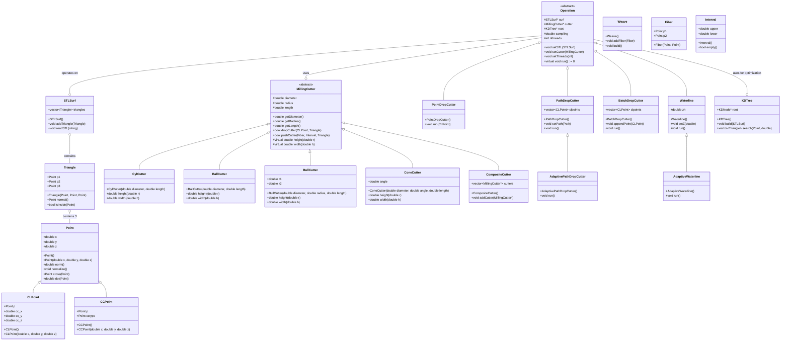

# OpenCAMLib (OCL) C++ 代码结构分析

OpenCAMLib (OCL) 是一个用于计算机辅助制造 (CAM) 的开源库，主要用于生成刀具路径和模拟铣削操作。本文档分析了OCL的C++实现部分，不包括Python和其他语言绑定。

## 整体架构 UML 图

## 模块分析

### 1. 几何模块 (geo/)

几何模块提供了基本的几何原语和数据结构，是OCL的基础。

#### 核心类

- **Point**: 三维空间中的点或向量，具有x、y、z坐标。提供向量运算（点积、叉积）、归一化和距离计算等功能。
- **Triangle**: 由三个Point组成的三角形，是STL模型的基本单元。提供法线计算和点包含测试等功能。
- **STLSurf**: STL表面模型，由多个Triangle组成。提供STL文件读取和模型操作功能。
- **Line**: 由两个Point定义的线段。
- **Arc**: 圆弧几何体。
- **Path**: 由多个Line或Arc组成的路径。
- **BBox**: 轴对齐的边界框，用于快速相交测试。

几何模块为整个库提供了基础的数据结构和算法，其他所有模块都依赖于它。

### 2. 刀具模块 (cutters/)

刀具模块定义了各种类型的铣刀及其几何特性。

#### 核心类

- **MillingCutter**: 所有铣刀的抽象基类，定义了通用的刀具属性（直径、半径、长度）和操作（dropCutter、pushCutter）。
- **CylCutter**: 圆柱形铣刀。
- **BallCutter**: 球头铣刀。
- **BullCutter**: 牛鼻铣刀（圆角铣刀）。
- **ConeCutter**: 锥形铣刀。
- **CompositeCutter**: 复合铣刀，可以组合多个基本铣刀。

每种刀具都实现了特定的height()和width()方法，这些方法定义了刀具的几何特性，用于计算刀具与工件的接触点。

### 3. 刀具路径操作模块 (dropcutter/)

这个模块实现了各种刀具路径生成算法，特别是基于"drop cutter"技术的算法。

#### 核心类

- **PointDropCutter**: 在单个点上执行drop cutter操作。
- **PathDropCutter**: 沿着路径执行drop cutter操作。
- **AdaptivePathDropCutter**: 自适应版本的PathDropCutter，可以根据需要增加采样点。
- **BatchDropCutter**: 批量处理多个点的drop cutter操作，支持并行计算。

这些类都继承自Operation基类，提供了一致的接口和共享功能。

### 4. 算法模块 (algo/)

算法模块包含了更高级的CAM算法实现。

#### 核心类

- **Waterline**: 实现等高线加工策略。
- **AdaptiveWaterline**: 自适应版本的Waterline算法。
- **Weave**: 实现编织算法，用于生成复杂的刀具路径。
- **Fiber**: 表示空间中的一条线段，用于pushcutter算法。
- **Interval**: 表示一维区间，用于记录刀具与工件的接触区域。
- **Operation**: 所有CAM操作的抽象基类，提供了共享功能如设置刀具、设置STL模型等。

### 5. 通用工具模块 (common/)

通用工具模块提供了各种辅助功能和数据结构。

#### 核心类

- **KDTree**: k-d树实现，用于加速几何查询。
- **CLFilter**: 刀具位置点过滤器的基类。
- **LineCLFilter**: 线性刀具位置点过滤器。
- **Numeric**: 数值计算工具函数。

### 6. 主要接口 (ocl.hpp/ocl.cpp)

OCL的主要接口非常简洁，主要提供版本信息和线程控制功能。

## 总结

OpenCAMLib的C++实现采用了面向对象的设计，具有清晰的模块化结构。核心功能围绕几何表示、刀具定义和CAM算法展开。库的设计允许灵活组合不同的刀具和操作，以实现各种CAM策略。

主要的处理流程通常是:

1. 加载STL模型（STLSurf）
2. 选择刀具类型（MillingCutter的子类）
3. 创建操作（Operation的子类）
4. 设置操作参数
5. 执行操作（run方法）
6. 获取结果（通常是CLPoint集合）

库的设计支持多线程处理和算法优化（如使用KDTree），使其能够高效处理大型模型。
