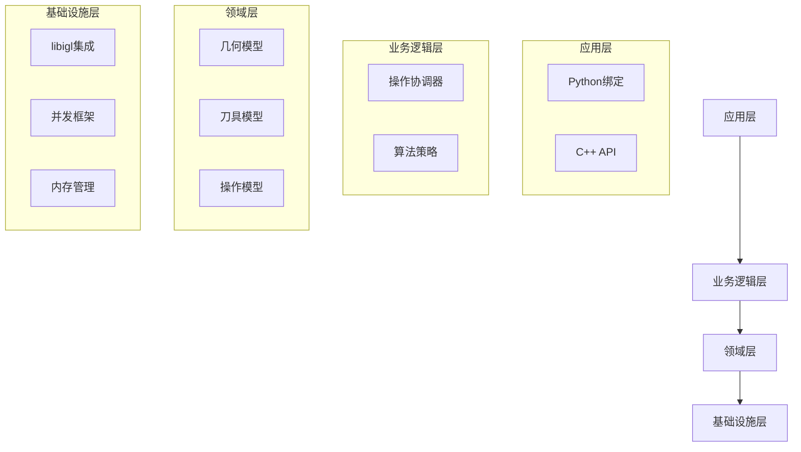
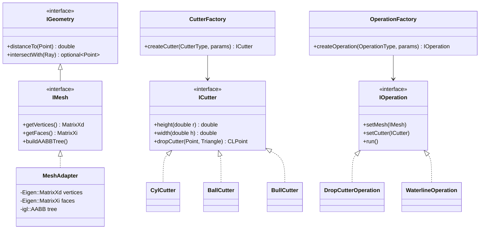

# OpenCAMLib (OCL) 重构计划

本文档详细描述了OpenCAMLib (OCL)的重构计划，旨在通过引入现代C++17特性、libigl库和适当的设计模式，提高代码的可维护性、性能和可扩展性。

## 1. 重构目标

- 采用C++17标准，利用其现代特性
- 集成libigl库，优化几何处理
- 应用合适的设计模式，改进代码结构
- 提高并发性能和资源管理
- 增强可测试性和可维护性
- 保持API兼容性（尽可能）
- Header Only Libraries

## 2. 架构重设计

### 2.1 整体架构

采用分层架构，将系统分为以下几层：



### 2.2 核心模块重构



## 3. 设计模式应用

### 3.1 工厂模式 (Factory Pattern)

用于创建刀具和操作对象，解耦对象创建和使用。

```cpp
// 刀具工厂
class CutterFactory {
public:
    static std::unique_ptr<ICutter> createCutter(CutterType type, const CutterParams& params) {
        switch (type) {
            case CutterType::Cylindrical:
                return std::make_unique<CylCutter>(params.diameter, params.length);
            case CutterType::Ball:
                return std::make_unique<BallCutter>(params.diameter, params.length);
            // 其他刀具类型...
            default:
                throw std::invalid_argument("Unknown cutter type");
        }
    }
};

// 使用示例
auto cutter = CutterFactory::createCutter(CutterType::Cylindrical, {10.0, 30.0});
```

### 3.2 策略模式 (Strategy Pattern)

用于实现不同的算法策略，如不同的路径生成算法。

```cpp
// 路径生成策略接口
class PathStrategy {
public:
    virtual ~PathStrategy() = default;
    virtual std::vector<CLPoint> generatePath(const IMesh& mesh, const ICutter& cutter) = 0;
};

// 具体策略实现
class ZigZagStrategy : public PathStrategy {
public:
    ZigZagStrategy(double stepover, double angle) : stepover_(stepover), angle_(angle) {}
    std::vector<CLPoint> generatePath(const IMesh& mesh, const ICutter& cutter) override {
        // 实现锯齿形路径生成算法
    }
private:
    double stepover_;
    double angle_;
};

// 使用策略
class PathGenerator {
public:
    PathGenerator(std::unique_ptr<PathStrategy> strategy) : strategy_(std::move(strategy)) {}
    std::vector<CLPoint> generatePath(const IMesh& mesh, const ICutter& cutter) {
        return strategy_->generatePath(mesh, cutter);
    }
private:
    std::unique_ptr<PathStrategy> strategy_;
};
```

### 3.3 观察者模式 (Observer Pattern)

用于实现操作进度通知和事件处理。

```cpp
// 观察者接口
class OperationObserver {
public:
    virtual ~OperationObserver() = default;
    virtual void onProgress(double percentage) = 0;
    virtual void onComplete() = 0;
    virtual void onError(const std::string& message) = 0;
};

// 可观察操作基类
class ObservableOperation : public IOperation {
public:
    void addObserver(std::shared_ptr<OperationObserver> observer) {
        observers_.push_back(observer);
    }
    
    void removeObserver(std::shared_ptr<OperationObserver> observer) {
        // 移除观察者
    }
    
protected:
    void notifyProgress(double percentage) {
        for (auto& observer : observers_) {
            observer->onProgress(percentage);
        }
    }
    
    void notifyComplete() {
        for (auto& observer : observers_) {
            observer->onComplete();
        }
    }
    
    void notifyError(const std::string& message) {
        for (auto& observer : observers_) {
            observer->onError(message);
        }
    }
    
private:
    std::vector<std::shared_ptr<OperationObserver>> observers_;
};
```

### 3.4 命令模式 (Command Pattern)

用于封装操作请求，支持操作队列和撤销/重做功能。

```cpp
// 命令接口
class Command {
public:
    virtual ~Command() = default;
    virtual void execute() = 0;
    virtual void undo() = 0;
};

// 具体命令
class DropCutterCommand : public Command {
public:
    DropCutterCommand(std::shared_ptr<IMesh> mesh, std::shared_ptr<ICutter> cutter, 
                     const Point& point, CLPoint& result)
        : mesh_(mesh), cutter_(cutter), point_(point), result_(result) {}
        
    void execute() override {
        // 保存旧结果用于撤销
        oldResult_ = result_;
        // 执行drop cutter操作
        result_ = cutter_->dropCutter(point_, *mesh_);
    }
    
    void undo() override {
        // 恢复旧结果
        result_ = oldResult_;
    }
    
private:
    std::shared_ptr<IMesh> mesh_;
    std::shared_ptr<ICutter> cutter_;
    Point point_;
    CLPoint& result_;
    CLPoint oldResult_;
};

// 命令管理器
class CommandManager {
public:
    void executeCommand(std::unique_ptr<Command> command) {
        command->execute();
        undoStack_.push_back(std::move(command));
        redoStack_.clear();
    }
    
    void undo() {
        if (undoStack_.empty()) return;
        
        auto command = std::move(undoStack_.back());
        undoStack_.pop_back();
        
        command->undo();
        redoStack_.push_back(std::move(command));
    }
    
    void redo() {
        // 实现重做功能
    }
    
private:
    std::vector<std::unique_ptr<Command>> undoStack_;
    std::vector<std::unique_ptr<Command>> redoStack_;
};
```

### 3.5 适配器模式 (Adapter Pattern)

用于适配libigl的数据结构到OCL的接口。

```cpp
// 适配libigl的网格表示到OCL的IMesh接口
class LibiglMeshAdapter : public IMesh {
public:
    LibiglMeshAdapter(const Eigen::MatrixXd& V, const Eigen::MatrixXi& F) 
        : vertices_(V), faces_(F) {
        buildAABBTree();
    }
    
    Eigen::MatrixXd getVertices() override { return vertices_; }
    Eigen::MatrixXi getFaces() override { return faces_; }
    
    void buildAABBTree() override {
        tree.init(vertices_, faces_);
    }
    
    double distanceTo(const Point& point) override {
        Eigen::RowVector3d p(point.x, point.y, point.z);
        Eigen::RowVector3d closest;
        int face_id;
        double dist = igl::point_mesh_squared_distance(p, vertices_, faces_, 
                                                     closest, face_id);
        return std::sqrt(dist);
    }
    
private:
    Eigen::MatrixXd vertices_;
    Eigen::MatrixXi faces_;
    igl::AABB<Eigen::MatrixXd, 3> tree;
};
```

### 3.6 装饰器模式 (Decorator Pattern)

用于动态扩展操作的功能。

```cpp
// 操作装饰器基类
class OperationDecorator : public IOperation {
public:
    OperationDecorator(std::shared_ptr<IOperation> operation) 
        : operation_(operation) {}
    
    void setMesh(std::shared_ptr<IMesh> mesh) override {
        operation_->setMesh(mesh);
    }
    
    void setCutter(std::shared_ptr<ICutter> cutter) override {
        operation_->setCutter(cutter);
    }
    
    void run() override {
        operation_->run();
    }
    
protected:
    std::shared_ptr<IOperation> operation_;
};

// 具体装饰器：添加进度报告
class ProgressReportingOperation : public OperationDecorator {
public:
    ProgressReportingOperation(std::shared_ptr<IOperation> operation, 
                              std::function<void(double)> progressCallback)
        : OperationDecorator(operation), progressCallback_(progressCallback) {}
    
    void run() override {
        // 设置进度监听
        // 假设我们可以拦截进度事件
        progressCallback_(0.0);
        operation_->run();
        progressCallback_(100.0);
    }
    
private:
    std::function<void(double)> progressCallback_;
};

// 使用示例
auto baseOperation = std::make_shared<DropCutterOperation>();
auto operationWithProgress = std::make_shared<ProgressReportingOperation>(
    baseOperation, 
    [](double progress) { std::cout << "Progress: " << progress << "%" << std::endl; }
);
operationWithProgress->run();
```

## 4. C++17 特性应用

### 4.1 智能指针

使用`std::unique_ptr`和`std::shared_ptr`替代原始指针，避免内存泄漏。

```cpp
// 旧代码
KDTree* tree = new KDTree();
// 使用tree
delete tree;

// 新代码
auto tree = std::make_unique<AABBTree>();
// 使用tree
// 自动释放
```

### 4.2 std::optional

用于表示可能不存在的值。

```cpp
std::optional<CLPoint> findContactPoint(const ICutter& cutter, const IMesh& mesh, const Point& point) {
    // 如果找到接触点，返回它
    if (foundContact) {
        return CLPoint{/*...*/};
    }
    // 否则返回空
    return std::nullopt;
}

// 使用
auto result = findContactPoint(cutter, mesh, point);
if (result) {
    // 使用 *result
} else {
    // 处理未找到的情况
}
```

### 4.3 结构化绑定

简化多返回值的处理。

```cpp
// 返回高度和宽度
std::pair<double, double> getHeightAndWidth(double r) {
    return {height(r), width(r)};
}

// 使用结构化绑定
auto [h, w] = cutter.getHeightAndWidth(5.0);
```

### 4.4 并行算法

使用`std::execution`命名空间中的并行策略。

```cpp
#include <execution>
#include <algorithm>

void batchDropCutter(const std::vector<Point>& points, std::vector<CLPoint>& results) {
    std::transform(
        std::execution::par,  // 并行执行
        points.begin(), points.end(),
        results.begin(),
        [this](const Point& p) {
            return this->dropCutterSingle(p);
        }
    );
}
```

### 4.5 折叠表达式

简化可变参数模板的使用。

```cpp
template<typename... Args>
void logMessage(Args&&... args) {
    (std::cout << ... << args) << std::endl;
}

// 使用
logMessage("Processing point ", x, ",", y, " with cutter diameter ", diameter);
```

## 5. libigl 集成

### 5.1 网格表示

使用Eigen矩阵替代自定义几何类。

```cpp
// 旧的表示方式
class STLSurf {
    std::vector<Triangle> triangles;
};

// 新的表示方式
class Mesh {
public:
    Eigen::MatrixXd V;  // 顶点坐标 (n,3)
    Eigen::MatrixXi F;  // 面索引 (m,3)
    
    // 从STL文件加载
    static Mesh fromSTL(const std::string& filename) {
        Mesh mesh;
        igl::readSTL(filename, mesh.V, mesh.F);
        return mesh;
    }
};
```

### 5.2 空间查询

使用libigl的AABB树进行高效空间查询。

```cpp
class MeshQuery {
public:
    MeshQuery(const Eigen::MatrixXd& V, const Eigen::MatrixXi& F) 
        : V_(V), F_(F) {
        tree_.init(V, F);
    }
    
    // 查找最近点
    std::tuple<Eigen::RowVector3d, int, double> closestPoint(const Eigen::RowVector3d& p) {
        Eigen::RowVector3d closest;
        int face_id;
        double sqrDist;
        igl::point_mesh_squared_distance(p, V_, F_, sqrDist, face_id, closest);
        return {closest, face_id, std::sqrt(sqrDist)};
    }
    
    // 射线相交测试
    std::optional<Eigen::RowVector3d> rayIntersection(
        const Eigen::RowVector3d& origin, 
        const Eigen::RowVector3d& direction) {
        
        std::vector<igl::Hit> hits;
        if (igl::ray_mesh_intersect(origin, direction, V_, F_, hits)) {
            // 计算交点
            double t = hits[0].t;
            Eigen::RowVector3d intersection = origin + t * direction;
            return intersection;
        }
        return std::nullopt;
    }
    
private:
    const Eigen::MatrixXd& V_;
    const Eigen::MatrixXi& F_;
    igl::AABB<Eigen::MatrixXd, 3> tree_;
};
```

### 5.3 几何处理

利用libigl的几何处理功能。

```cpp
// 提取等高线
std::tuple<Eigen::MatrixXd, Eigen::MatrixXi> extractWaterline(
    const Eigen::MatrixXd& V, const Eigen::MatrixXi& F, double z) {
    
    // 创建标量场（z坐标减去目标高度）
    Eigen::VectorXd S = V.col(2).array() - z;
    
    // 提取等值线
    Eigen::MatrixXd WV;  // 等值线顶点
    Eigen::MatrixXi WE;  // 等值线边
    igl::marching_cubes(S, V, F, 0.0, WV, WE);
    
    return {WV, WE};
}
```

## 6. 模块重构详细计划

### 6.1 几何模块重构

```cpp
// 点/向量表示
using Point = Eigen::Vector3d;
using Vector3 = Eigen::Vector3d;

// 网格接口
class IMesh {
public:
    virtual ~IMesh() = default;
    virtual const Eigen::MatrixXd& vertices() const = 0;
    virtual const Eigen::MatrixXi& faces() const = 0;
    virtual std::tuple<Point, int, double> closestPoint(const Point& p) const = 0;
    virtual std::optional<Point> rayIntersection(const Point& origin, const Vector3& direction) const = 0;
};

// libigl实现
class LibiglMesh : public IMesh {
public:
    LibiglMesh(const std::string& filename) {
        igl::readSTL(filename, V_, F_);
        tree_.init(V_, F_);
    }
    
    const Eigen::MatrixXd& vertices() const override { return V_; }
    const Eigen::MatrixXi& faces() const override { return F_; }
    
    std::tuple<Point, int, double> closestPoint(const Point& p) const override {
        // 实现...
    }
    
    std::optional<Point> rayIntersection(const Point& origin, const Vector3& direction) const override {
        // 实现...
    }
    
private:
    Eigen::MatrixXd V_;
    Eigen::MatrixXi F_;
    igl::AABB<Eigen::MatrixXd, 3> tree_;
};
```

### 6.2 刀具模块重构

```cpp
// 刀具接口
class ICutter {
public:
    virtual ~ICutter() = default;
    virtual double getDiameter() const = 0;
    virtual double getLength() const = 0;
    virtual double height(double r) const = 0;
    virtual double width(double h) const = 0;
    virtual CLPoint dropCutter(const Point& point, const IMesh& mesh) const = 0;
};

// 圆柱刀具实现
class CylCutter : public ICutter {
public:
    CylCutter(double diameter, double length) 
        : diameter_(diameter), radius_(diameter/2), length_(length) {}
    
    double getDiameter() const override { return diameter_; }
    double getLength() const override { return length_; }
    
    double height(double r) const override {
        return (r > radius_) ? -1.0 : 0.0;
    }
    
    double width(double h) const override {
        return (h < 0.0) ? -1.0 : radius_;
    }
    
    CLPoint dropCutter(const Point& point, const IMesh& mesh) const override {
        // 实现...
    }
    
private:
    double diameter_;
    double radius_;
    double length_;
};

// 其他刀具类型...
```

### 6.3 操作模块重构

```cpp
// 操作接口
class IOperation {
public:
    virtual ~IOperation() = default;
    virtual void setMesh(std::shared_ptr<IMesh> mesh) = 0;
    virtual void setCutter(std::shared_ptr<ICutter> cutter) = 0;
    virtual void run() = 0;
    virtual std::vector<CLPoint> getResults() const = 0;
};

// Drop Cutter操作
class DropCutterOperation : public IOperation {
public:
    void setMesh(std::shared_ptr<IMesh> mesh) override { mesh_ = mesh; }
    void setCutter(std::shared_ptr<ICutter> cutter) override { cutter_ = cutter; }
    
    void setPoints(const std::vector<Point>& points) {
        points_ = points;
        results_.resize(points.size());
    }
    
    void run() override {
        if (!mesh_ || !cutter_) {
            throw std::runtime_error("Mesh or cutter not set");
        }
        
        std::transform(
            std::execution::par,
            points_.begin(), points_.end(),
            results_.begin(),
            [this](const Point& p) {
                return cutter_->dropCutter(p, *mesh_);
            }
        );
    }
    
    std::vector<CLPoint> getResults() const override {
        return results_;
    }
    
private:
    std::shared_ptr<IMesh> mesh_;
    std::shared_ptr<ICutter> cutter_;
    std::vector<Point> points_;
    std::vector<CLPoint> results_;
};
```

## 7. 实现路线图

### 7.1 阶段一：基础设施

1. 设置现代CMake构建系统
2. 集成libigl库
3. 实现基础几何适配器
4. 创建单元测试框架

### 7.2 阶段二：核心模块重构

1. 重构几何模块，使用libigl和Eigen
2. 重构刀具模块，应用工厂模式
3. 重构操作模块，应用策略和命令模式
4. 实现并发框架

### 7.3 阶段三：高级功能

1. 实现观察者模式用于进度报告
2. 添加命令模式支持撤销/重做
3. 优化算法实现
4. 完善错误处理

### 7.4 阶段四：API和绑定

1. 设计稳定的C++ API
2. 更新Python绑定
3. 编写文档

## 8. 测试策略

1. **单元测试**：使用Boost-unit-test-framework测试各个组件
2. **集成测试**：测试组件间交互
3. **性能测试**：与原始实现比较性能
4. **回归测试**：确保与原始API兼容

## 9. 文档计划

1. API文档：使用Doxygen生成
2. 用户指南：使用Sphinx生成
3. 示例代码：提供各种使用场景的示例

## 10. 总结

通过引入现代C++17特性、libigl库和适当的设计模式，OpenCAMLib将获得显著的改进：

- 更清晰的代码结构和更好的可维护性
- 更高的性能和更低的内存占用
- 更好的可扩展性和可测试性
- 更现代的API和更好的用户体验

这个重构计划将使OpenCAMLib成为一个更加现代化、高效和易于使用的CAM库。
