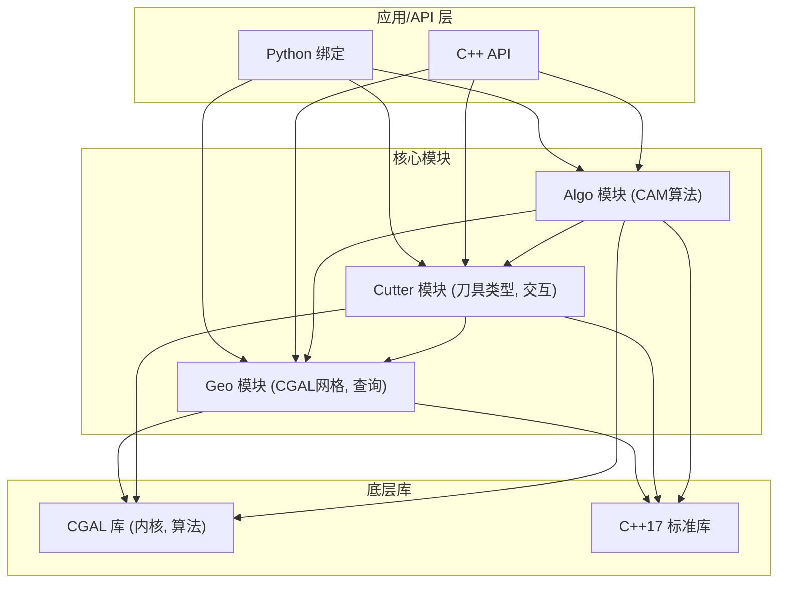
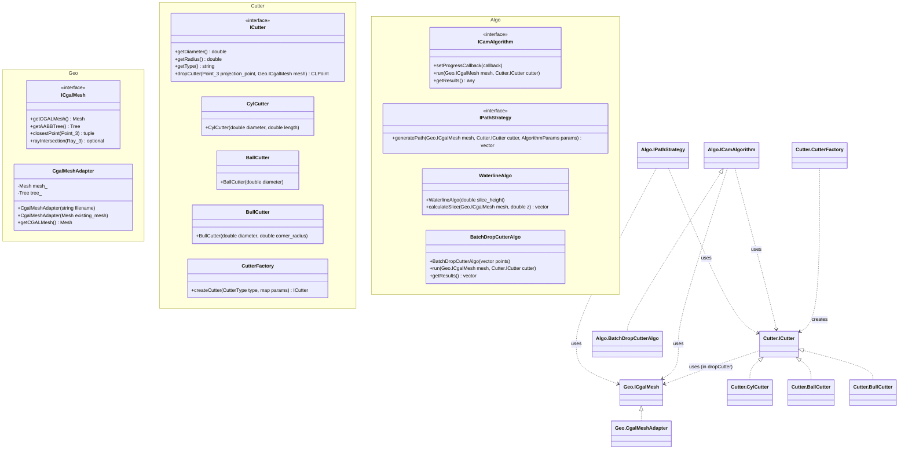

# OpenCAMLib (OCL) 重构计划 (基于 CGAL)

本文档详细描述了OpenCAMLib (OCL)的重构计划，旨在通过引入现代C++17特性、**CGAL (Computational Geometry Algorithms Library)** 和适当的设计模式，显著提高代码的**鲁棒性**、**精确性**、可维护性、性能和可扩展性。特别关注利用CGAL的精确几何计算 (EGC) 和强大的几何算法来处理复杂的CAM场景。

## 相关文档

本重构项目包含以下相关文档：

- [Legacy_OCL.md](./Legacy_OCL.md) - 原始OCL库的架构和设计文档
- [cutter.md](./cutter.md) - 刀具模型设计与实现
- [drop_cutter.md](./drop_cutter.md) - Drop Cutter算法详细说明
- [push_cutter.md](./push_cutter.md) - Push Cutter算法详细说明
- [weave.md](./weave.md) - Weave算法详细说明
- [adaptive_algorithm.md](./adaptive_algorithm.md) - 自适应加工算法详细说明
- [KDTree.md](./KDTree.md) - KD树数据结构实现与应用 (可能被CGAL替代)
- [TDD.md](./TDD.md) - 测试驱动开发(TDD)的实施计划

## 1. 重构目标

- 采用C++17标准，利用其现代特性
- **深度集成CGAL库，利用其精确计算内核和丰富的几何算法**
- 应用合适的设计模式，改进代码结构
- **重点提升复杂几何运算的鲁棒性和精度**
- 提高并发性能和资源管理
- 增强可测试性和可维护性
- 保持API兼容性（尽可能）
- Header Only Libraries (如果可行，CGAL某些部分可能需要编译)

## 2. 架构重设计 (Geo, Cutter, Algo 结构)

### 2.1 整体架构

采用基于功能划分的三模块核心架构：`Geo` (几何), `Cutter` (刀具), 和 `Algo` (算法)。应用/API层与这些核心模块交互，核心模块内部则依赖CGAL库和C++17标准库。



这种结构将几何处理、刀具定义和加工算法清晰地分离开来。

### 2.2 核心模块接口预览 (基于 CGAL)



*注意：这是一个高层级的预览，具体的类和接口将在详细设计中确定。`CLPoint`，`Polyline_3`, `PathData`, `AlgorithmParams` 等是需要定义的辅助类型。算法接口(`ICamAlgorithm`, `IPathStrategy`)的设计有多种方式，这里仅为示例。*

## 3. 设计模式应用

设计模式的应用在这种三模块结构下依然重要：

- **工厂模式 (Factory Pattern)**: 在 `Cutter` 模块中使用 `CutterFactory` 创建不同类型的 `ICutter` 对象。也可以考虑在 `Algo` 模块为算法或策略创建工厂。
- **策略模式 (Strategy Pattern)**: 在 `Algo` 模块中用于实现可互换的路径生成策略（如锯齿形、环绕形）、下刀策略等。
- **观察者模式 (Observer Pattern)**: `Algo` 模块中的长时间运行算法可以实现为可观察对象，允许应用层（或API层）订阅进度更新或完成事件。
- **命令模式 (Command Pattern)**: 可以封装整个 `Algo` 模块的算法调用，以便支持撤销/重做、操作队列或日志记录。每个命令对象会持有算法、参数、输入（Mesh/Cutter）和执行逻辑。
- **适配器模式 (Adapter Pattern)**: `Geo` 模块的核心是 `CgalMeshAdapter`，它适配CGAL的底层数据结构到OCL所需的 `ICgalMesh` 接口。
- **装饰器模式 (Decorator Pattern)**: 可以用来动态地给 `Algo` 模块中的算法添加功能，例如计时、额外的日志记录或特定的预处理/后处理步骤。
- **外观模式 (Facade Pattern)**: 可以在API层提供一个简化的接口（例如 `CamEngine` 类），隐藏 `Geo`, `Cutter`, `Algo` 模块之间的交互细节，为用户提供更易用的入口点。

## 4. C++17 特性应用

C++17特性的应用（智能指针, `std::optional`, 结构化绑定, 并行算法, 折叠表达式）与`Refactor_OCL.md`中的计划完全一致，这些特性与选择哪个几何库无关。

## 5. CGAL 集成

这是与基于libigl方案的核心区别。

### 5.1 选择CGAL内核 (Kernel)

- **关键决策**：根据精度和性能需求选择合适的内核。
  - `Exact_predicates_inexact_constructions_kernel` (EPICK): 谓词（如方向测试、相交测试）精确，构造（如交点坐标）使用浮点数。通常是鲁棒性和性能的良好折衷。**推荐作为起点。**
  - `Exact_predicates_exact_constructions_kernel` (EPEC): 谓词和构造都精确。提供最高的鲁棒性，但性能开销较大，需要使用CGAL特定的数字类型（如`Gmpq`）。适用于布尔运算等需要完全精确结果的场景。
  - `Simple_cartesian<double>`: 标准浮点数内核，速度快但可能存在鲁棒性问题。不推荐用于需要高鲁棒性的CAM。
- 内核的选择将决定几何对象（`Point_3`, `Vector_3`, `Triangle_3`等）的具体类型和行为。

### 5.2 网格表示

- **选择数据结构**：
  - `CGAL::Surface_mesh`: 现代、高效、灵活的半边数据结构，推荐用于表示三角网格。
  - `CGAL::Polyhedron_3`: 较旧但功能仍然强大的半边数据结构。
  - BGL接口：CGAL可以与Boost Graph Library集成，提供更通用的图结构表示。
- **适配**：需要编写适配器类（如`CgalMeshAdapter`）将所选的CGAL网格结构封装起来，暴露OCL所需的接口。

### 5.3 空间查询

- **AABB树**: 使用`CGAL::AABB_tree`进行高效的最近点查询、射线相交、距离查询等。其性能和功能通常优于手动实现的KD树。
- **其他结构**: 根据需要，可以利用CGAL的其他空间数据结构，如k-d树 (`CGAL::Kd_tree`) 等。

### 5.4 核心几何算法

- **布尔运算**: 利用`CGAL::Polygon_mesh_processing`或Nef Polyhedra进行精确、鲁棒的网格布尔运算（联合、相交、差集），这是CGAL的关键优势之一，对型腔加工、避免碰撞等非常有用。
- **偏移 (Offsetting)**: 使用CGAL的曲面偏移或闵可夫斯基和相关算法计算刀具路径。
- **三角剖分/网格生成**: 利用CGAL强大的2D/3D三角剖分和网格生成能力。
- **相交计算**: 使用CGAL提供的各种几何对象（线段、平面、三角形、多面体）的精确相交测试和计算。
- **距离计算**: 精确计算点到点、点到线、点到面、几何对象之间的距离。

```cpp
// 示例：使用CGAL进行布尔运算 (概念性, 使用 PMP)
#include <CGAL/Polygon_mesh_processing/corefinement.h>
#include <CGAL/Polygon_mesh_processing/IO/polygon_mesh_io.h>
#include <CGAL/Exact_predicates_exact_constructions_kernel.h> // Recommended for Boolean ops
#include <CGAL/Surface_mesh.h>

namespace PMP = CGAL::Polygon_mesh_processing;
using Kernel = CGAL::Exact_predicates_inexact_constructions_kernel; // Or EPEC
using Point_3 = Kernel::Point_3;
using Mesh = CGAL::Surface_mesh<Point_3>;


// It might be necessary to use EPEC kernel for robust booleans
// using EPEC_Kernel = CGAL::Exact_predicates_exact_constructions_kernel;
// using EPEC_Mesh = CGAL::Surface_mesh<EPEC_Kernel::Point_3>;

// Function might need to handle kernel conversion if input meshes use EPICK
bool computeBooleanDifference(Mesh& meshA, const Mesh& meshB, Mesh& resultMesh) {
    // Note: Actual use requires ensuring meshes are valid (closed, manifold, etc.)
    // PMP functions often return true on success, false on failure.
    // Consider using EPEC kernel for the operation itself if maximum robustness is needed.
    // This might involve temporary mesh copies or conversion.
    // Check CGAL documentation for the specific parameters and requirements.
    return PMP::corefine_and_compute_difference(meshA, meshB, resultMesh); // Basic call
    // Example with parameters (check documentation for available options):
    // return PMP::corefine_and_compute_difference(meshA, meshB, resultMesh,
    //                                             CGAL::parameters::throw_on_self_intersection(true));
}
```

## 6. 模块重构详细计划 (Geo, Cutter, Algo 结构)

### 6.1 Geo 模块重构

- **职责**:
  - 封装CGAL内核选择和初始化。
  - 提供核心几何数据结构表示，主要是三角网格 (`CGAL::Surface_mesh`)。
  - 实现网格加载（如STL, OFF）和可能的保存功能。
  - 封装CGAL空间查询结构，主要是 `CGAL::AABB_tree`。
  - 提供一个稳定的接口 (`ICgalMesh`) 给 `Cutter` 和 `Algo` 模块使用，隐藏底层CGAL细节。
  - 执行基础的网格有效性检查或修复（可选）。
- **核心接口/类**:
  - `ICgalMesh`: 定义 `Geo` 模块对外提供的核心功能（见2.2节）。
  - `CgalMeshAdapter`: `ICgalMesh` 的主要实现，内部持有 `CGAL::Surface_mesh` 和 `CGAL::AABB_tree`。
  - 可能需要辅助函数或类来处理内核和类型定义。
- **实现要点**:
  - 使用PIMPL模式或纯接口来隐藏 `CgalMeshAdapter` 中的CGAL头文件依赖，避免将其泄露到 `ICgalMesh` 的用户。
  - 确保 `AABB_tree` 在网格修改后能正确更新或重建。
  - 提供健壮的错误处理（例如，文件加载失败、无效网格）。
  - 所有返回CGAL几何对象（如 `Point_3`）的方法都需要确保使用者知道它们依赖于选定的内核。

### 6.2 Cutter 模块重构

- **职责**:
  - 定义各种刀具类型的几何形状和参数（圆柱、球头、牛鼻等）。
  - 提供 `ICutter` 接口，统一不同刀具类型的访问方式。
  - 实现核心的刀具与网格交互逻辑，最重要的是 `dropCutter` 方法。
  - 提供工厂 (`CutterFactory`) 来创建和管理刀具实例。
- **核心接口/类**:
  - `ICutter`: 统一接口（见2.2节）。
  - `CylCutter`, `BallCutter`, `BullCutter` 等具体实现。
  - `CutterFactory`: 创建 `ICutter` 实例。
  - `CLPoint`: 定义刀触点的数据结构（包含点坐标、法线、有效性标志等）。
- **实现要点**:
  - `dropCutter` 的实现是关键。它将接收 `Point_3` (投影点) 和 `Geo.ICgalMesh` 对象。
  - `dropCutter` 内部将调用 `ICgalMesh` 的方法（如 `rayIntersection`, `closestPoint`）来查找潜在接触点。
  - 需要根据 `ICutter` 的具体类型（球头 vs 平底）来调整查询逻辑，以正确模拟刀具底部与网格的接触。例如，球头刀的接触点是其球心投影到网格上最近的点加上半径乘以法线（近似），而平底刀则复杂得多，可能涉及射线相交或更复杂的偏移表面查询。
  - 考虑 `dropCutter` 的鲁棒性，处理找不到接触点、接触在边缘/顶点等情况，并使用 `CLPoint` 中的 `valid` 标志返回结果。
  - `CutterFactory` 应能根据类型和参数（如直径、半径、长度）创建正确的刀具对象。

### 6.3 Algo 模块重构

- **职责**:
  - 实现各种具体的CAM加工算法（如等高线、平行精加工、区域清根、自适应粗加工等）。
  - 协调 `Geo` 和 `Cutter` 模块的功能来完成算法任务。
  - 管理算法参数和配置。
  - 生成算法结果，通常是刀路点序列 (`std::vector<CLPoint>`) 或更复杂的路径结构。
  - （可选）提供算法执行的控制，如中断、进度报告。
- **核心接口/类**:
  - **算法执行单元**: 可以是实现了某个通用接口（如 `ICamAlgorithm`）的类，或者是一系列独立的函数/类。例如 `WaterlineAlgo`, `ParallelFinishAlgo`, `BatchDropCutterAlgo`。
  - **策略接口 (可选)**: 如 `IPathStrategy`，用于在算法内部切换不同的路径生成逻辑。
  - **算法参数结构**: 用于传递算法所需的特定参数（如切深、步距、加工区域等）。
  - **结果数据结构**: 定义如何表示生成的刀路（如 `std::vector<CLPoint>`, `PathData` 包含多段路径）。
- **实现要点**:
  - 算法逻辑将严重依赖 `Geo.ICgalMesh` 进行查询（如获取边界、等高线、最近点、相交判断）和 `Cutter.ICutter` 进行刀具相关的计算（主要是 `dropCutter` 来确定每个路径点的Z高度和法向）。
  - 许多算法涉及在2D平面（通常是XY平面）上进行计算（如区域偏置、网格生成），然后将结果投影回3D模型并使用 `dropCutter`。CGAL的2D功能（如2D内核、排列、直线扫描、多边形操作）在这里非常有用。
  - 对于计算密集型算法（如涉及大量 `dropCutter` 调用的精加工），应考虑使用 `std::transform` 和 `std::execution::par` 进行并行化。确保传递给并行部分的lambda函数是线程安全的（对 `ICgalMesh` 和 `ICutter` 的 `const` 方法调用通常是安全的，但需谨慎）。
  - 实现进度报告（通过回调函数）和可能的取消机制。
  - 设计清晰的API，无论是通过一系列自由函数、算法类还是一个统一的 `CamEngine` 外观类。

## 7. 实现路线图 (基于 Geo, Cutter, Algo 结构)

### 7.1 阶段一：Geo 模块基础与CGAL核心集成

1. 设置现代CMake构建系统，**正确链接CGAL库及其依赖 (GMP, MPFR, Boost)**。
2. **选择并确定使用的CGAL内核 (Kernel)** (推荐从EPICK开始)。
3. **实现 `Geo` 模块**:
    - 定义 `ICgalMesh` 接口。
    - 实现 `CgalMeshAdapter`，封装 `Surface_mesh` 和 `AABB_tree`。
    - 实现基本的网格加载 (`read_polygon_mesh`)。
    - 实现核心查询方法 (`closestPoint`, `rayIntersection`)。
4. 创建单元测试框架，**编写针对 `Geo` 模块的测试** (加载, 查询)。

### 7.2 阶段二：Cutter 模块与基础 Algo

1. **实现 `Cutter` 模块**:
    - 定义 `ICutter` 接口和 `CLPoint` 结构。
    - 实现 `CutterFactory`。
    - 实现至少一种具体刀具（如 `BallCutter`），包括其 `dropCutter` 方法（初始版本可以较简单，依赖 `Geo` 模块）。
2. **实现基础 `Algo` 模块**:
    - 实现一个简单的算法，如 `BatchDropCutterAlgo`，用于测试 `Geo` 和 `Cutter` 的集成。
    - 测试 `dropCutter` 的正确性和鲁棒性。
3. **集成测试**: 确保 `Algo` 可以正确使用 `Geo` 和 `Cutter`。

### 7.3 阶段三：扩展 Algo 模块与高级功能

1. **扩展 `Algo` 模块**:
    - 实现更复杂的算法，如 `WaterlineAlgo`（需要CGAL的平面相交或等值面功能）。
    - 实现路径生成策略 (`IPathStrategy`)，如平行线扫描。
    - 引入算法参数结构。
2. **利用CGAL高级功能**:
    - 根据需要，在 `Algo` 或 `Geo` 中引入布尔运算 (`Polygon_mesh_processing`)、偏移、2D计算等。
    - 如果需要最高鲁棒性，考虑在特定算法中使用 EPEC 内核（可能需要内核转换）。
3. **完善 `Cutter` 模块**: 提高 `dropCutter` 的精度和鲁棒性（如处理平底刀）。
4. **实现辅助功能**: 观察者模式（进度报告）、命令模式（撤销/重做）。
5. **性能优化**: 对计算密集型算法应用并行化 (`std::execution::par`)，仔细检查线程安全。

### 7.4 阶段四：API、绑定与文档

1. **设计和实现稳定的 C++ API**:
    - 考虑使用 Facade 模式 (`CamEngine`) 简化用户交互。
    - **隐藏CGAL模板和内核细节**，避免暴露到API层。
2. **更新Python绑定**: 使用 pybind11 或类似工具，处理C++类型（包括CGAL点、向量、自定义结果结构）到Python的转换。
3. **编写文档**:
    - API 文档 (Doxygen)。
    - 用户指南 (Sphinx)，**解释模块结构、用法、CGAL依赖和注意事项**。
    - 示例代码。

## 8. 测试策略

1. **单元测试**: 分别测试 `Geo` (适配器、查询), `Cutter` (`dropCutter`), `Algo` (具体算法逻辑) 的各个单元。**特别关注边界条件和CGAL调用**。
2. **集成测试**: 测试模块间的交互，例如 `Algo` 使用 `Geo` 和 `Cutter` 的场景。**模拟复杂几何和加工场景**。
3. **性能测试**: 与原始实现以及基于libigl的方案比较性能，**评估不同CGAL内核 (EPICK vs EPEC) 的性能影响**。
4. **回归测试**: 确保与原始API兼容或明确记录API变更。
5. **鲁棒性测试**: 设计专门的测试用例，包含大量边界情况和已知会导致浮点数问题的几何体，验证CGAL带来的鲁棒性提升。使用CGAL提供的模型生成器或外部数据集。

## 9. 文档计划

1. API文档：使用Doxygen生成，**清晰标注函数的前提条件和可能的异常**。
2. 用户指南：使用Sphinx或类似工具生成，**详细解释CGAL内核的选择、精度考虑、以及如何处理潜在的CGAL特定问题**。
3. 示例代码：提供各种使用场景的示例，**展示如何利用CGAL的特性解决复杂的CAM问题**。
4. **CGAL依赖说明**: 清晰列出所需的CGAL模块及其依赖库(Boost, GMP, MPFR等)的版本要求和安装指南。

## 10. 总结

通过引入现代C++17特性、**CGAL库**和适当的设计模式，并特别关注利用CGAL的**精确几何计算 (EGC)** 和**鲁棒算法**，OpenCAMLib将获得以下关键改进：

- **显著提升的鲁棒性**: CGAL的精确谓词和（可选的）精确构造能够正确处理退化情况和复杂的几何交互，减少因浮点数误差导致的失败。
- **更高的精度保证**: 能够进行需要精确结果的操作，如布尔运算、偏移计算等。
- **更强的几何处理能力**: 可以利用CGAL广泛而成熟的算法库处理更复杂的CAM任务。
- 更清晰的代码结构和更好的可维护性（通过设计模式和C++17）。
- 更好的可扩展性和可测试性。

**需要权衡的方面：**

- **更高的学习曲线**: CGAL的概念（内核、Traits）和模板化的API比libigl更复杂。
- **潜在的性能开销**: 精确计算内核（如EPEC）通常比浮点数计算慢。需要仔细选择内核并在性能关键路径上进行优化。
- **更复杂的构建依赖**: CGAL通常依赖GMP、MPFR和Boost等外部库，增加了构建和部署的复杂性。
- **API设计挑战**: 需要精心设计API以隐藏CGAL的复杂性，避免将模板化的CGAL类型暴露给库的使用者。

尽管存在这些挑战，但对于追求最高鲁棒性和需要处理复杂几何场景的CAM应用，采用CGAL进行重构，**并结合清晰的 `Geo`, `Cutter`, `Algo` 模块化设计**，将为OpenCAMLib带来根本性的优势，使其能够解决以前难以处理或容易出错的问题，成为一个功能更强大、更可靠的CAM核心库。
