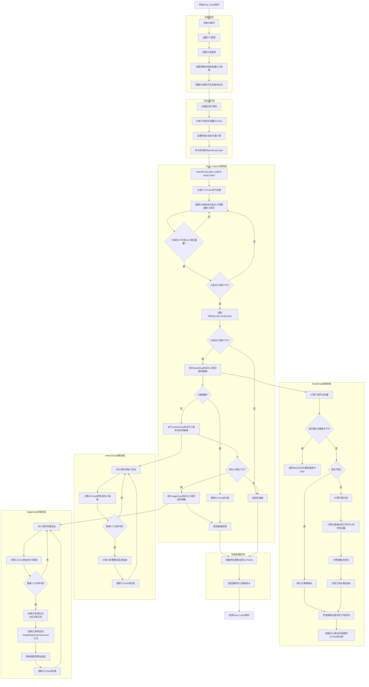

# Drop Cutter 算法分析

Drop Cutter是计算机辅助制造(CAM)中的一个基础算法，用于确定刀具在给定XY位置上可以下降到的最低高度，而不会切入工件。本文档分析了OpenCAMLib中Drop Cutter算法的实现。

## 1. 算法概述

Drop Cutter算法的核心思想是：在给定的XY位置，将刀具从高处垂直下降，直到与工件表面接触，然后记录这个接触点的位置。这个过程需要考虑刀具的几何形状和工件表面的几何特性。

OpenCAMLib实现了几种不同复杂度的Drop Cutter操作：

- **PointDropCutter**: 处理单个点
- **BatchDropCutter**: 批量处理多个点，支持多线程
- **PathDropCutter**: 沿路径采样点并进行处理
- **AdaptivePathDropCutter**: 自适应采样的路径处理

## 2. 执行流程

Drop Cutter算法的执行流程可以分为四个主要阶段：

### 2.1 设置阶段

1. 初始化操作对象
2. 设置STL表面模型
3. 设置刀具类型(圆柱刀、球头刀、牛鼻刀等)
4. 设置参数(采样距离、最小Z值等)
5. 构建KD树用于空间查询优化
    > **KD树与其他空间数据结构比较**
    >
    > - **KD树 (K-Dimensional Tree)**
    >   - 原理：基于点的空间划分树，每层沿一个坐标轴划分空间
    >   - 优点：查询效率高，内存占用适中，适合点数据，实现相对简单
    >   - 缺点：不太适合高维数据，对于动态数据需要重建
    >   - 适用性：非常适合Drop Cutter中的点查询和范围查询
    >
    > - **AABB树 (Axis-Aligned Bounding Box Tree)**
    >   - 原理：使用轴对齐的边界框层次结构来组织几何数据
    >   - 优点：构建速度快，查询效率高（特别是轴对齐查询），内存占用适中
    >   - 缺点：对于非轴对齐的几何体可能有较大空白区域，降低效率
    >   - 适用性：适合Drop Cutter，因为查询是垂直向下的（轴对齐的）
    >
    > - **OBB树 (Oriented Bounding Box Tree)**
    >   - 原理：使用方向任意的边界框层次结构，边界框可与几何特征对齐
    >   - 优点：比AABB树更紧密地包围几何体，对非轴对齐几何体效率更高
    >   - 缺点：构建和维护成本高，相交测试更复杂，内存占用更大
    >   - 适用性：对于具有明显方向性的模型有优势，但额外复杂性可能不值得
    >
    > - **BVH (Bounding Volume Hierarchy)**
    >   - 原理：通用的边界体积层次结构，可使用不同类型的边界体积
    >   - 优点：灵活性高，可针对特定几何特性优化，支持动态更新
    >   - 缺点：实现复杂度高，如选择不当可能不如专用数据结构高效
    >   - 适用性：提供灵活性，对于复杂形状的刀具可能有优势
    >
    > - **空间哈希 (Spatial Hashing)**
    >   - 原理：将3D空间划分为网格单元，使用哈希函数映射几何体到这些单元
    >   - 优点：构建非常快，内存使用可控，查询时间接近常数（均匀分布时）
    >   - 缺点：对不均匀分布的数据效率低，网格大小选择困难
    >   - 适用性：对于均匀分布的模型有优势，但精确计算可能不够精确
    >
    > - **八叉树 (Octree)**
    >   - 原理：递归地将3D空间划分为八个等大的子空间
    >   - 优点：自适应空间划分，内存使用高效，适合非均匀分布数据
    >   - 缺点：对细长对象效率不高，深度过大时内存消耗增加
    >   - 适用性：对于细节变化大的模型有优势，适合自适应采样算法
    >
    > **为什么选择KD树**：在Drop Cutter算法中，KD树被选为首选数据结构，因为它在查询效率、内存使用和构建速度之间取得了良好平衡，特别适合处理点查询和范围查询，这正是Drop Cutter算法的核心需求。

### 2.2 点生成阶段

1. 对路径进行采样
2. 为每个采样点创建CLPoint(刀具位置点)
3. 设置初始Z高度为最小值
4. 将点添加到BatchDropCutter

### 2.3 Drop Cutter计算阶段

1. 对每个CLPoint：
   - 使用KD树查找可能与刀具重叠的三角形
   - 对于每个可能重叠的三角形：
     - 检查刀具是否真的在XY平面上与三角形重叠
     - 如果重叠且刀具在三角形下方，执行dropCutter操作
     > 重叠+下方的双重判断是该算法效率的关键：
     > 1.减少计算量：通过快速排出不相关的三角形，大大减少了需要进行复杂几何计算的次数
     > 2.保证正确性：确保只有可能影响刀具最终位置的三角形才会被考虑
     > 3.优化性能：这种筛选看可以将计算时间从O(n)降低到接近O(log n),其中n是模型中的三角形数量

2. MillingCutter.dropCutter执行三种测试：
   - **facetDrop**: 测试与三角形面的接触
   - **vertexDrop**: 测试与三角形顶点的接触
   - **edgeDrop**: 测试与三角形边的接触

3. 每种测试可能会更新CLPoint的Z值，使刀具抬高到不会切入工件的位置

### 2.4 结果收集阶段

1. 收集所有更新后的CLPoints
2. 这些点代表刀具刚好接触表面而不会切入的位置

## 3. 核心算法伪代码

### 3.1 顶层操作流程

```
函数 PathDropCutter.run():
    清空结果点集 clpoints
    对于路径中的每个线段 span:
        sample_span(span)  // 对线段进行采样
    
    subOp[0].run()  // 调用BatchDropCutter执行实际的drop cutter操作
    clpoints = subOp[0].getCLPoints()  // 获取结果
    
函数 PathDropCutter.sample_span(span):
    num_steps = span.length2d() / sampling + 1
    对于 i 从 0 到 num_steps:
        fraction = i / num_steps
        ptmp = span.getPoint(fraction)  // 在线段上采样点
        p = 新建 CLPoint(ptmp.x, ptmp.y, ptmp.z)
        p.z = minimumZ  // 设置初始Z高度为最小值
        subOp[0].appendPoint(p)  // 添加到BatchDropCutter
```

### 3.2 BatchDropCutter核心算法

```
函数 BatchDropCutter.run():
    dropCutter5()  // 调用最优化的算法版本
    
函数 BatchDropCutter.dropCutter5():
    calls = 0
    对于每个CLPoint点 clp (可并行处理):
        // 使用KD树查找可能与刀具重叠的三角形
        triangles = root.search_cutter_overlap(cutter, clp)
        
        对于每个找到的三角形 t:
            if cutter.overlaps(clp, t):  // 检查XY平面上是否真的重叠
                if clp.below(t):  // 检查刀具是否在三角形下方
                    cutter.dropCutter(clp, t)  // 执行drop cutter操作
                    calls++
    
    nCalls = calls
```

### 3.3 MillingCutter核心算法

```
函数 MillingCutter.dropCutter(CLPoint cl, Triangle t):
    facet = false
    vertex = false
    edge = false
    
    if cl.below(t):  // 如果刀具在三角形下方
        facet = facetDrop(cl, t)  // 先测试与三角形面的接触
        
        if !facet:  // 如果没有与面接触，则测试顶点和边
            vertex = vertexDrop(cl, t)
            
            if cl.below(t):  // 如果仍在三角形下方
                edge = edgeDrop(cl, t)
    
    return (facet || vertex || edge)  // 返回是否有接触
```

### 3.4 三种基本测试

```
函数 MillingCutter.facetDrop(CLPoint cl, Triangle t):
    normal = t.upNormal()  // 获取三角形法向量
    
    if normal.z 接近于 0:  // 垂直面无法进行drop cutter
        return false
    
    if normal.x 接近于 0 且 normal.y 接近于 0:  // 水平面特殊情况
        cc_tmp = 新建 CCPoint(cl.x, cl.y, t.p[0].z, FACET)
        return cl.liftZ_if_inFacet(cc_tmp.z, cc_tmp, t)
    else:  // 一般情况
        // 计算平面方程 ax + by + cz + d = 0
        d = -normal.dot(t.p[0])
        normal.normalize()
        
        xyNormal = 新建 Point(normal.x, normal.y, 0.0)
        xyNormal.xyNormalize()
        
        // 计算从接触点到刀具中心的半径向量
        radiusvector = this.xy_normal_length * xyNormal + this.normal_length * normal
        
        // 计算接触点
        cc_tmp = cl - radiusvector
        cc_tmp.z = (1.0/normal.z) * (-d - normal.x*cc_tmp.x - normal.y*cc_tmp.y)
        cc_tmp.type = FACET
        
        // 计算刀具尖端Z坐标
        tip_z = cc_tmp.z + radiusvector.z - this.center_height
        
        // 如果接触点在三角形内，则更新刀具Z坐标
        return cl.liftZ_if_inFacet(tip_z, cc_tmp, t)
```

```
函数 MillingCutter.vertexDrop(CLPoint cl, Triangle t):
    result = false
    
    对于三角形的每个顶点 p:
        q = cl.xyDistance(p)  // 计算XY平面上的距离
        
        if q <= radius:  // 如果顶点在刀具半径内
            cc_tmp = 新建 CCPoint(p, VERTEX)
            
            // 计算刀具需要抬高的高度，height(q)由具体刀具类型实现
            if cl.liftZ(p.z - this.height(q), cc_tmp):
                result = true
    
    return result
```

```
函数 MillingCutter.edgeDrop(CLPoint cl, Triangle t):
    result = false
    
    对于三角形的每条边 (p1, p2):
        if p1和p2在XY平面上不重合:
            d = cl.xyDistanceToLine(p1, p2)  // 计算到边的距离
            
            if d <= radius:  // 如果边在刀具半径内
                if singleEdgeDrop(cl, p1, p2, d):
                    result = true
    
    return result
```

### 3.5 刀具特定实现

不同的刀具类型实现了特定版本的height(r)和singleEdgeDropCanonical()方法：

```
函数 BallCutter.height(double r):
    if r >= radius:
        return -1  // 超出刀具半径
    else:
        return radius - sqrt(radius^2 - r^2)  // 球面方程
```

```
函数 BullCutter.height(double r):
    if r <= radius1:  // 圆柱部分
        return 0.0
    else if r <= radius:  // 环面部分
        return radius2 - sqrt(radius2^2 - (r-radius1)^2)
    else:  // 超出刀具半径
        return -1
```

```
函数 CylCutter.singleEdgeDropCanonical(Point u1, Point u2):
    // 计算接触点的X坐标
    s = sqrt(radius^2 - u1.y^2)
    
    // 有两个可能的接触点
    cc1 = 新建 Point(s, u1.y, 0)
    cc2 = 新建 Point(-s, u1.y, 0)
    
    // 将接触点投影到边上
    cc1.z_projectOntoEdge(u1, u2)
    cc2.z_projectOntoEdge(u1, u2)
    
    // 选择Z值较高的点
    if cc1.z > cc2.z:
        cc_u = cc1.x
        cl_z = cc1.z
    else:
        cc_u = cc2.x
        cl_z = cc2.z
    
    return (cc_u, cl_z)  // 返回接触点的U坐标和刀具Z坐标
```

## 4. 执行流程图



## 5. 优化策略

OpenCAMLib中的Drop Cutter算法采用了多种优化策略：

1. **KD树**: 用于快速查找可能与刀具交互的三角形
2. **提前终止**: 如果facetDrop检测到接触，则跳过边和顶点测试
3. **多线程处理**: BatchDropCutter使用OpenMP进行并行处理
4. **自适应采样**: AdaptivePathDropCutter在曲率高的区域增加采样密度

## 6. 应用示例

使用PathDropCutter的典型流程：

1. 创建包含线段的Path对象
2. 创建PathDropCutter并设置STL模型、刀具和路径
3. 设置采样距离和最小Z值
4. 调用run()方法
5. 获取结果CLPoints作为刀具路径

这个算法允许OpenCAMLib高效地计算刀具路径，使刀具能够跟随3D模型表面而不会切入工件，这对CNC加工操作至关重要。

## 7. 两步重叠检测的详细解析

Drop Cutter算法中采用的两步重叠检测是提高性能的关键策略，下面详细解释这两个检测步骤：

### 7.1 第一步：KD树空间查询

**目的**：快速筛选出可能与刀具重叠的三角形，大幅减少需要进行精确检测的三角形数量。

**原理**：

- KD树将三维空间递归地划分为不同区域，每个节点代表一个分割平面
- 三角形存储在KD树的叶节点中，根据其边界框的空间位置
- 查询时使用刀具的**特殊查询体积**在KD树中进行空间搜索

**重要说明 - 刀具查询体积**：

- Drop Cutter算法中的KD树查询**不仅仅**是简单地计算刀具当前位置的包围盒与工件三角形的重叠
- 对于每个刀具位置(x,y,z)，算法构建了一个特殊的**查询柱体**：
  - XY平面：以刀具在XY平面上的投影圆为基础（半径为刀具半径）
  - Z方向：从当前z坐标**一直向上延伸到无穷大**
  - 这个"向上无限延伸的圆柱体"确保了能找到所有可能在刀具上方的三角形

**search_cutter_overlap 方法实现**：

```cpp
std::list<Triangle*> KDNode::search_cutter_overlap(const MillingCutter& cutter, const Point& cl) const {
    std::list<Triangle*> tris;
    if (this->isLeaf()) {
        // 叶节点，检查内部的所有三角形
        BOOST_FOREACH(Triangle* t, this->triangles) {
            tris.push_back(t);
        }
        return tris;
    }

    // 计算刀具在XY平面上的边界框
    double radius = cutter.getRadius();
    Point cutter_bb_min = Point(cl.x - radius, cl.y - radius, cl.z);
    Point cutter_bb_max = Point(cl.x + radius, cl.y + radius, INFINITY); // Z方向延伸到无穷大

    // 根据分割维度和位置，决定递归搜索哪些子节点
    if (dim == 0) { // 按X轴分割
        if (cl.x - radius <= split) // 刀具边界框左侧超过分割面
            tris.splice(tris.end(), pLow->search_cutter_overlap(cutter, cl));
        if (cl.x + radius >= split) // 刀具边界框右侧超过分割面
            tris.splice(tris.end(), pHigh->search_cutter_overlap(cutter, cl));
    } else if (dim == 1) { // 按Y轴分割
        // 类似X轴的判断...
    } else { // 按Z轴分割
        if (cl.z <= split) // 刀具当前Z位置在分割面下方
            tris.splice(tris.end(), pLow->search_cutter_overlap(cutter, cl));
        
        // 由于我们的查询体积向上延伸到无穷大，总是需要检查上半部分的节点
        tris.splice(tris.end(), pHigh->search_cutter_overlap(cutter, cl));
    }
    
    return tris;
}
```

**为什么这种方式能处理"刀具在工件下方"的情况**：

1. **"无穷高"的查询体积**：
   - 查询的不是刀具的实际包围盒，而是从刀具当前位置向上延伸到无穷大的圆柱体
   - 这确保了无论刀具当前位置多低，都能找到其上方的所有可能相交三角形

2. **Z方向的特殊处理**：
   - 当KD树按Z轴分割时，如果分割平面在刀具上方，算法总是会搜索上半部分
   - 这是因为我们需要找到刀具上方的所有三角形，以确定"最低的接触点"

3. **实际工作流程示例**：
   - 假设刀具位于z=-10的位置，而工件最低点在z=0
   - KD树查询会创建一个从z=-10延伸到z=∞的圆柱体
   - 这个查询体积会与位于z≥0的工件三角形相交
   - 从而返回所有可能与刀具在XY平面投影重叠的三角形，无论其Z坐标多高

4. **Drop Cutter的本质**：
   - Drop Cutter算法的核心是"从高处向下查找最先接触的表面"
   - 通过构造从当前位置向上无限延伸的查询体积，算法能够找到所有可能在刀具下降路径上的三角形

**KD树查询的视觉表示**：

```
     z
     |          工件三角形
     |         /  |  \
     |        /   |   \
     |       /    |    \
     |      --------------
     |           /|\
     |          / | \     查询圆柱体 (向上无限延伸)
     |         /  |  \
     |        /   |   \ 
     o-------x----+----y---
              刀具中心
```

这种特殊的查询方式确保了无论刀具初始位置多低，KD树查询总能找到上方可能与刀具接触的所有三角形，从而使后续的精确计算能够正确确定最低接触点。

### 7.2 第二步：精确XY平面重叠检测

**目的**：对KD树筛选出的三角形进行精确的重叠检测，排除第一步中的"误报"。

**原理**：

- 判断刀具在XY平面上的投影圆是否与三角形的XY投影重叠
- 检查过程考虑了刀具的具体形状和三角形的精确边界

**实现**：

```cpp
bool MillingCutter::overlaps(Point &cl, const Triangle &t) const {
    // 计算刀具中心到三角形各顶点的最小XY距离
    double minDist = std::min({
        cl.xyDistance(t.p[0]),
        cl.xyDistance(t.p[1]),
        cl.xyDistance(t.p[2])
    });
    
    // 如果最小距离小于刀具半径，可能重叠
    if (minDist <= radius) {
        // 检查点是否在三角形内
        if (t.containsPointXY(cl)) {
            return true;
        }
        
        // 检查刀具是否与三角形边重叠
        for (int i=0; i<3; i++) {
            int j = (i+1)%3;
            double d = cl.xyDistanceToLine(t.p[i], t.p[j]);
            if (d <= radius) {
                return true;
            }
        }
    }
    
    return false;
}
```

**特点**：

1. **精确但较慢**：这一步进行精确的几何计算，比KD树查询慢但更准确
2. **仅对候选三角形**：只检查KD树筛选出的少量三角形，而不是整个模型
3. **几何特性考量**：考虑刀具和三角形的实际几何形状，而不仅仅是边界框
4. **投影检测**：在XY平面上进行检测，忽略Z轴信息

### 7.3 为什么需要两步检测

1. **性能优化**：
   - KD树查询是一种"空间过滤器"，快速排除大部分三角形
   - 精确重叠检测计算成本较高，只对少量候选三角形执行
   - 两步结合可将算法复杂度从O(n)降低到接近O(log n)

2. **精度保证**：
   - KD树查询可能产生"误报"（返回实际不重叠的三角形）
   - 第二步精确检测排除这些误报，确保计算的准确性
   - 组合使用确保不会漏掉任何可能的接触

3. **实际效果**：
   - 在典型的STL模型中（含有数千或数万个三角形），第一步可能将候选三角形减少到原来的1%或更少
   - 第二步进一步减少需要进行完整dropCutter计算的三角形数量
   - 最终只有真正可能与刀具接触的三角形才会进行详细的接触计算

### 7.4 实际案例分析

假设一个含有10,000个三角形的STL模型，以及位于特定XY位置的刀具：

1. **不使用优化**：需要对所有10,000个三角形进行详细的dropCutter计算
2. **只使用KD树**：可能将候选三角形减少到约100个，但包含一些不实际重叠的三角形
3. **使用两步检测**：
   - KD树查询筛选出约100个候选三角形
   - 精确XY平面重叠检测进一步将其减少到约20个真正可能接触的三角形
   - 只对这20个三角形执行完整的dropCutter接触计算

这种两步检测机制是Drop Cutter算法高效处理大型STL模型的关键所在，使算法在处理复杂模型时保持高性能而不牺牲精度。
