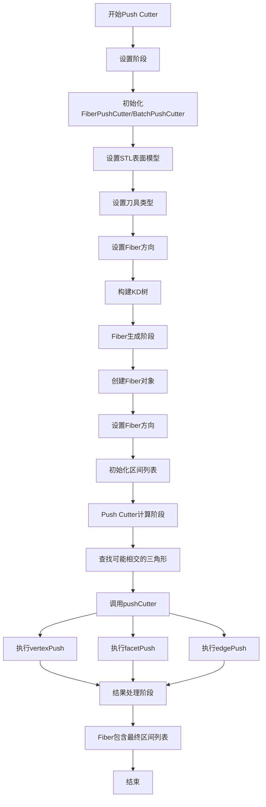
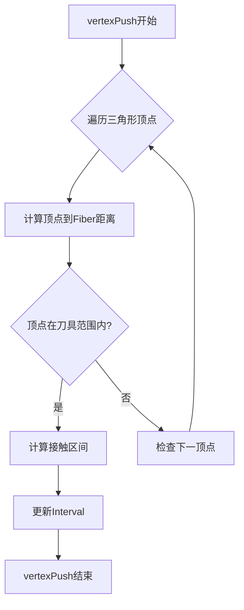
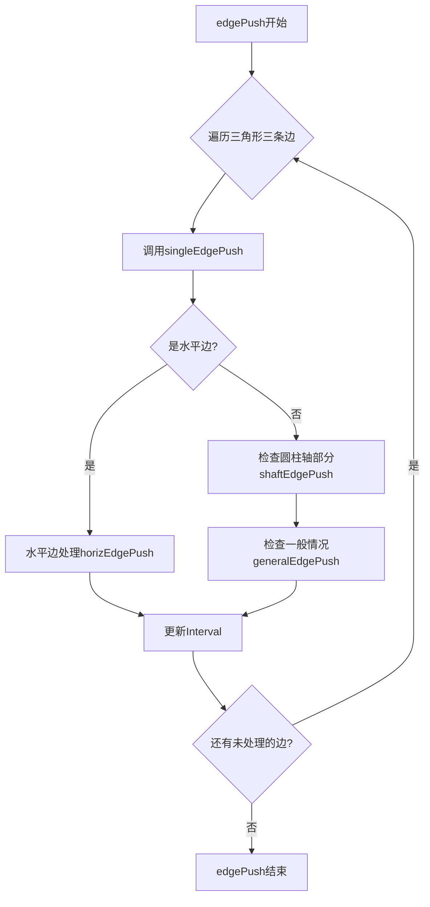
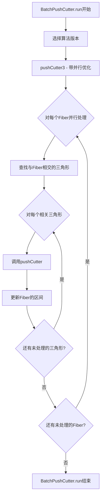
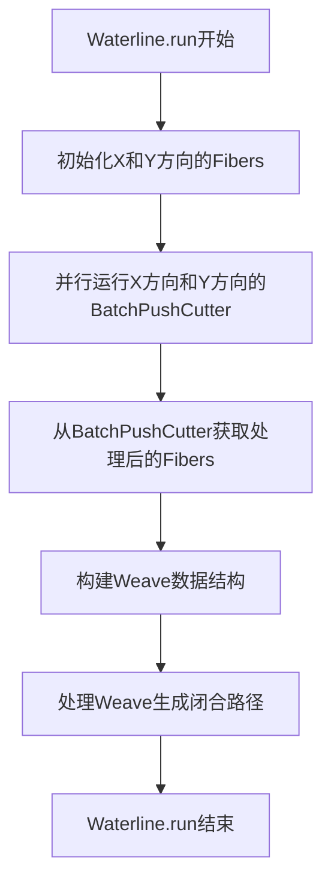

# Push Cutter 算法分析

Push Cutter是计算机辅助制造(CAM)中的一个关键算法，用于确定刀具沿特定方向移动时与工件表面的接触情况。本文档分析了OpenCAMlib中Push Cutter算法的实现。

## 1. 算法概述

Push Cutter算法的核心思想是：沿着一条直线（称为Fiber），确定刀具与工件表面的接触区间。与Drop Cutter（垂直降下刀具）相比，Push Cutter处理的是水平推入刀具的情况。

OpenCAMlib实现了以下Push Cutter操作：

- **FiberPushCutter**: 处理单个Fiber
- **BatchPushCutter**: 批量处理多个Fiber，支持多线程

## 2. 关键组件

### 2.1 Fiber类

Fiber代表空间中的一条无限直线，沿此线刀具可以移动：

- **定义**：由两点p1和p2定义的参数化直线
- **参数方程**：`f(t) = p1 + t * (p2 - p1)`，其中t可以是任何实数
- **区间**：包含多个Interval对象，表示刀具与工件接触的区间
- **无限特性**：尽管由两点定义，Fiber在数学上是无限延伸的

### 2.2 Interval类

Interval表示Fiber上的一个区间：

- **存储**：区间的上下界值（tval参数）和相应的接触点(CC points)
- **操作**：提供更新、合并区间的方法

## 3. 执行流程



Push Cutter算法的执行流程可分为四个主要阶段：

### 3.1 设置阶段

1. 初始化FiberPushCutter或BatchPushCutter对象
2. 设置STL表面模型
3. 设置刀具类型(圆柱刀、球头刀、牛鼻刀等)
4. 设置Fiber方向(X方向或Y方向)
5. 构建KD树用于空间查询优化

### 3.2 Fiber生成阶段

1. 创建Fiber对象，指定起点和终点
2. 设置Fiber的方向（calcDir方法）
3. 初始化Fiber的区间列表为空

### 3.3 Push Cutter计算阶段

在FiberPushCutter的run方法中：

1. 对给定的Fiber：
   - 使用KD树查找可能与Fiber相交的三角形
   - 对于每个相关三角形，调用cutter.pushCutter(fiber, interval, triangle)

2. MillingCutter.pushCutter执行三种测试：
   - **vertexPush**: 测试刀具与三角形顶点的接触
   - **facetPush**: 测试刀具与三角形面的接触
   - **edgePush**: 测试刀具与三角形边的接触

3. 每种测试计算出在Fiber上的接触区间，添加到Fiber的区间列表中

### 3.4 结果处理阶段

1. Fiber包含最终的区间列表，表示刀具可在哪些区域移动而不会切入工件
2. 这些信息可用于生成刀具路径或其他CAM操作

## 4. 核心算法详解

### 4.1 vertexPush算法



vertexPush检查刀具在Fiber上移动时是否会接触到三角形的顶点。对于每个顶点p：

1. 计算顶点到Fiber在XY平面投影的最近距离q
2. 计算顶点高度与Fiber高度之差h
3. 使用刀具的width(h)函数计算在该高度处刀具的有效半径
4. 如果q小于有效半径，则计算沿Fiber的接触区间并更新Interval

### 4.2 facetPush算法

```mermaid
flowchart TD
    A[facetPush开始] --> B[获取三角形法向量]
    B --> C{法向量平行于Z轴?}
    C -->|是| D[返回false]
    C -->|否| E[建立数学方程]
    E --> F{Fiber方向是X还是Y?}
    F -->|X方向| G[设置X方向系数]
    F -->|Y方向| H[设置Y方向系数]
    G --> I[求解方程获取u,v]
    H --> I
    I --> J{接触点在三角形内?}
    J -->|否| D
    J -->|是| K[计算Fiber上的t值]
    K --> L{t在[0,1]范围内?}
    L -->|否| M[记录警告]
    L -->|是| N[更新Interval]
    M --> N
    N --> O[facetPush结束]
```

facetPush计算刀具与三角形面的接触。这是一个复杂的几何问题：

1. 获取三角形的法向量
2. 如果法向量平行于Z轴，直接返回（无法推入垂直于Z轴的面）
3. 建立方程组表示刀具与平面接触的条件
4. 根据Fiber方向（X或Y）设置不同的系数
5. 使用two_by_two_solver求解方程组得到三角形内的参数坐标(u,v)
6. 验证接触点是否在三角形内
7. 计算接触点在Fiber上的参数t值
8. 如果t不在[0,1]范围内，可能表示Fiber太短
9. 更新Interval

### 4.3 edgePush算法



edgePush检查刀具与三角形边的接触：

1. 遍历三角形的三条边
2. 对每条边调用singleEdgePush，它会依次尝试：
   - horizEdgePush: 处理水平边特殊情况
   - shaftEdgePush: 处理刀具圆柱轴部分的接触
   - generalEdgePush: 处理各种刀具的特殊实现
3. 如果接触存在，计算接触区间并更新Interval

## 5. BatchPushCutter的实现

BatchPushCutter扩展了基本的FiberPushCutter功能，支持批量处理多个Fiber，并利用OpenMP实现并行计算。



BatchPushCutter提供了三种算法版本：

- pushCutter1: 最简单的实现，测试每个Fiber与所有三角形
- pushCutter2: 使用KD树优化，查找可能相交的三角形
- pushCutter3: 在pushCutter2的基础上使用OpenMP进行并行计算

## 6. Waterline应用

Waterline算法是Push Cutter的一个重要应用，它使用两个BatchPushCutter操作（X和Y方向）来生成等高线切削路径：



Waterline算法流程：

1. 初始化X方向和Y方向的Fibers网格
2. 运行两个BatchPushCutter操作处理这些Fibers
3. 从两个方向的Fibers构建Weave数据结构
4. 处理Weave，提取闭合路径作为等高线

## 7. 性能考虑

### 7.1 优化策略

- **KD树空间索引**：减少三角形搜索时间
- **方向性优化**：根据Fiber方向优化KD树
- **并行计算**：使用OpenMP加速计算
- **区间合并**：优化区间存储和处理

### 7.2 精度问题

- **tval超出范围**：当计算的tval超出[0,1]范围时，需要考虑Fiber长度是否足够
- **特殊几何情况**：处理近垂直面、退化三角形等特殊情况
- **数值稳定性**：在浮点计算中保持足够的精度

## 8. 总结

Push Cutter是CAM系统中的关键算法，它确定了刀具在特定方向上与工件表面的交互。通过组合X和Y方向的Push Cutter结果，可以构建Weave数据结构并生成复杂的等高线切削路径。

OpenCAMlib的Push Cutter实现通过KD树空间索引、精确的几何计算和并行处理优化，为高效的CAM路径规划提供了坚实基础。
